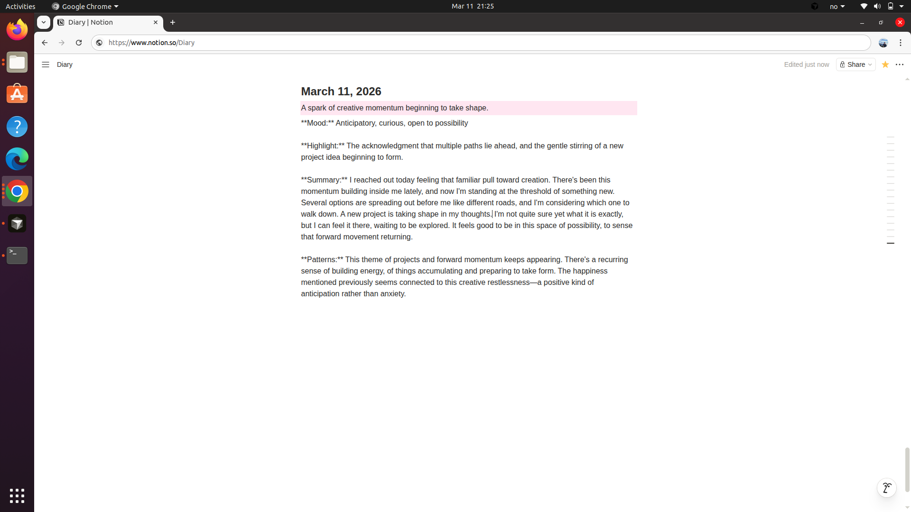

# ai-diary-assistant
Interactive chat diary that summarizes and saves the talk in Notion


# 🗒️ AI Diary Updater

A conversational AI diary assistant that lets you interactively chat about your day, then automatically summarizes the conversation and saves a structured entry to Notion.

Built with Python, Claude (Anthropic), Gradio, and the Notion API.

---

## Features

- **Conversational journaling** — chat naturally about your day instead of staring at a blank page
- **AI-powered summaries** — Claude extracts mood, highlights, and patterns from your conversation
- **Notion integration** — entries are saved automatically with a date, theme, and summary
- **Context-aware** — the assistant reads your recent entries to notice patterns over time
- **Clean UI** — simple Gradio web interface, runs locally in your browser

---

## Demo



---

## Tech Stack

- [Python 3.10+](https://www.python.org/)
- [Anthropic Claude API](https://docs.anthropic.com/) — conversational AI and summarization
- [Gradio](https://www.gradio.app/) — web UI
- [Notion API](https://developers.notion.com/) — diary storage
- [OpenAI Python SDK](https://github.com/openai/openai-python) — used as the HTTP client for the Anthropic API
- [python-dotenv](https://pypi.org/project/python-dotenv/) — environment variable management

---

## Getting Started

### 1. Clone the repository

```bash
git clone https://github.com/your-username/diary-updater.git
cd diary-updater
```

### 2. Install dependencies

```bash
pip install openai notion-client gradio python-dotenv
```

### 3. Set up your API keys

Create a `.env` file in the project root:

```
ANTHROPIC_API_KEY=your_anthropic_api_key
DIARY_UPDATER_TOKEN=your_notion_integration_token
NOTION_PAGE_ID=your_notion_page_id
```

**Getting your keys:**
- **Anthropic API key** → [console.anthropic.com](https://console.anthropic.com)
- **Notion integration token** → [notion.com/my-integrations](https://www.notion.com/my-integrations) (create an Internal integration)
- **Notion page ID** → the 32-character string at the end of your Notion page URL

### 4. Connect Notion

Open your Notion page, click **···** → **Add connections** → select your integration.

### 5. Run the app

```bash
python interactive_diary_assistant.py
```

Then open [http://127.0.0.1:7860](http://127.0.0.1:7860) in your browser.

---

## How It Works

1. Open the app and chat with Claude about your day
2. Claude uses your recent diary entries as context to personalize responses
3. When you're done, click **Save to Notion**
4. Claude summarizes the conversation into a structured diary entry covering mood, highlights, and patterns
5. The entry is saved to your Notion page with today's date

---

## Project Structure

```
ai-diary-assistant/
├── assets/
│   ├── screenshot_chat1.png
│   ├── screenshot_chat2.png
│   ├── screenshot_chat3.png
│   └── screenshot_notion.png
├── interactive_diary_assistant.py   # Main application
├── .env               # API keys (never commit this!)
├── .gitignore
└── README.md
```


---

## Security

Never commit your `.env` file. Make sure your `.gitignore` includes:

```
.env
```

---

## License

MIT
